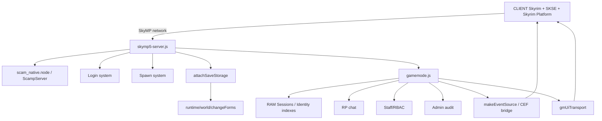
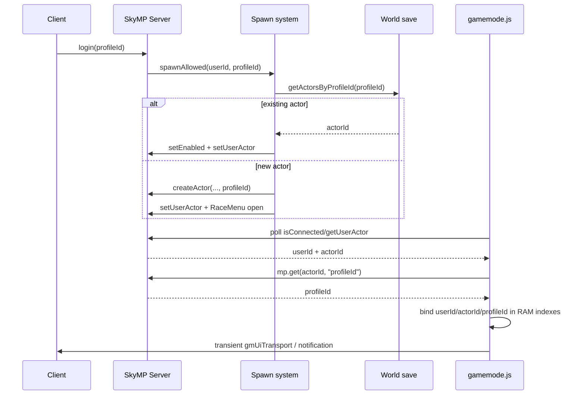
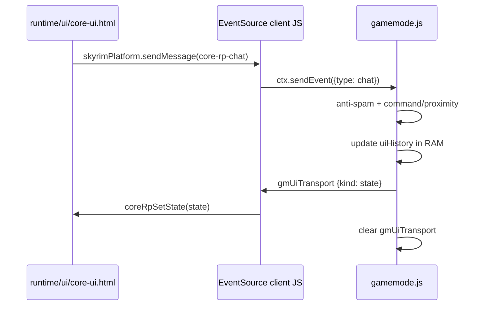
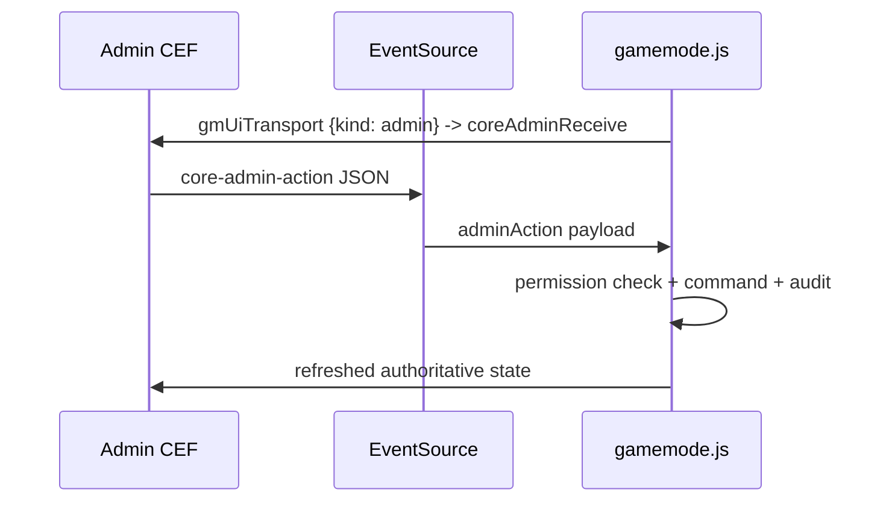

# Архитектура SkyMP RP fork — Core GM v5.1.0

## Основной runtime flow



## Join / reconnect



`profileId` не ищется перебором. SkyMP имеет стандартный property binding `profileId`, который возвращает profile id самого actor.

## Session / identity model

```text
sessions             userId    -> session
sessionsByActor      actorId   -> session
sessionsByProfile    profileId -> session

session = {
  userId,
  actorId,
  profileId,
  connectedAt,
  ready,
  lastPlaytimeFlushAt
}
```

`userId` — только runtime connection slot. Persistent identity в текущем one-character model — `profileId` actor'а. В будущем рекомендуется разделить accountId и characterId.

## Chat bridge



## Admin bridge



## Persistence boundaries

### SkyMP native world save

`runtime/world/changeForms/*.json` хранит position/world/cell, appearance, inventory и другие actor fields.

### Persistent RP metadata

`gmFirstSeen`, `gmLastSeen`, `gmJoinCount`, `gmDeathCount`, `gmPlaytimeSeconds`, `gmRpName`.

### Runtime only

`sessions`, `sessionsByActor`, `sessionsByProfile`, `uiHistory`, `spamBuckets`, `backLocations`, `adminUiOpen`.

### UI transport

`gmUiTransport` — краткоживущий envelope для stock client. Authoritative UI/chat state находится в RAM; transport очищается после доставки.

## UI source

Редактируемый интерфейс:

```text
runtime/ui/core-ui.html
```

При загрузке gamemode файл читается сервером и преобразуется в `data:text/html;charset=utf-8,...` URL. Это сохраняет совместимость со stock `skymp5-client.js`, но убирает hardcoded base64 из `gamemode.js`.

## Архитектурные правила

1. Не использовать `userId` как persistent identity.
2. `profileId` брать из actor binding, а не искать scan'ом.
3. Не дублировать position persistence в SQL без причины.
4. UI action всегда проверяется authoritative server logic.
5. Staff permissions проверяются на сервере.
6. Offline `profileId` не является production authentication.

---

## Voice architecture — Core GM 5.2.0

Voice deliberately stays outside SkyMP's binary/network core.

```text
Core GM VoiceService
  -> gmVoiceTransport (owner-only transient)
  -> SkyrimPlatform shared storage
  -> secret-skyrim-voice.js
  -> HTTP 127.0.0.1:38471
  -> SkyrimVoice.dll (Mumble plugin)
  -> ordinary bundled Mumble client
  -> Mumble Server
```

The game server is the source of truth for the allowed proximity set. The Mumble plugin provides positional data and filters incoming speech according to the latest `audible[]` route. Physical character position continues to be persisted exclusively by native SkyMP world/changeForms storage.

Launcher owns the client Voice Runtime lifecycle. It uses a dedicated Mumble configuration and database, starts Voice before SKSE and terminates only its own Mumble PID after Skyrim exits.
